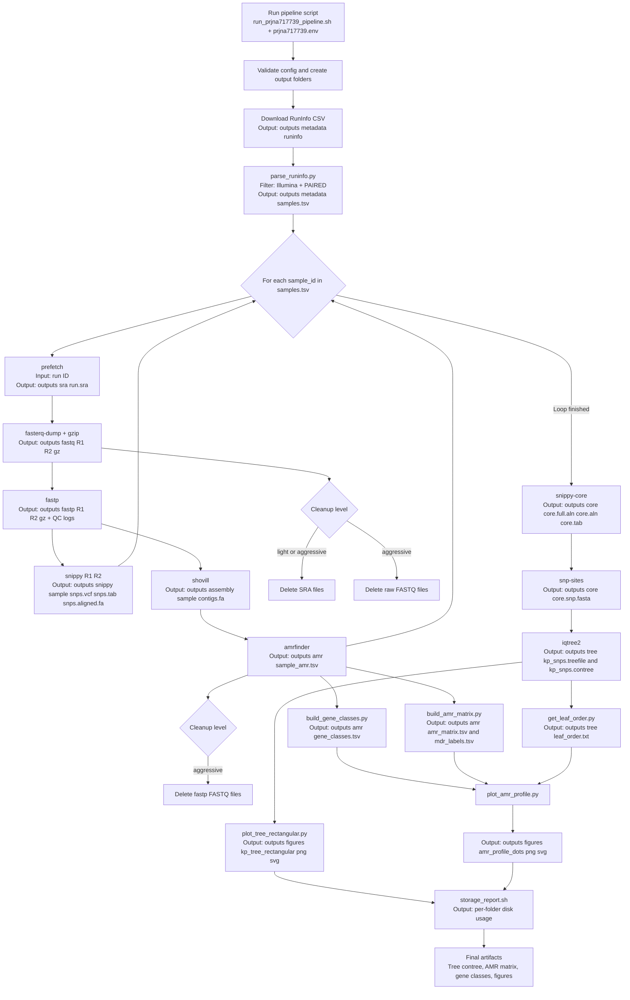

# Flowchart detallado

Este diagrama resume el pipeline completo con componentes, scripts, entradas y salidas.

## Scripts y contratos (input/output)

| Script | Input principal | Output principal |
|---|---|---|
| `scripts/parse_runinfo.py` | `runinfo_<BIOPROJECT>.csv` | `samples.tsv` (solo Illumina paired-end) |
| `scripts/run_prjna717739_pipeline.sh` | `config/prjna717739.env` + utilidades CLI | Arbol completo de `outputs/` |
| `scripts/build_gene_classes.py` | `outputs/amr/*_amr.tsv` | `outputs/amr/gene_classes.tsv` |
| `scripts/build_amr_matrix.py` | `outputs/amr/*_amr.tsv` + `samples.tsv` | `amr_matrix.tsv` + `mdr_labels.tsv` |
| `scripts/get_leaf_order.py` | `kp_snps.contree` | `leaf_order.txt` |
| `scripts/plot_tree_rectangular.py` | `kp_snps.contree` | `kp_tree_rectangular.png/.svg` |
| `scripts/plot_amr_profile.py` | `leaf_order.txt`, `amr_matrix.tsv`, `gene_classes.tsv` | `amr_profile_dots.png/.svg` |
| `scripts/storage_report.sh` | `outputs/` | reporte de consumo de almacenamiento |

## Notas de trazabilidad

- La llave canonica es `sample_id` desde `samples.tsv`.
- La integracion filogenia-resistoma se hace por `sample_id` + `leaf_order.txt`.
- El cleanup nunca elimina archivos finales de analisis (arbol, matrices AMR, figuras).
